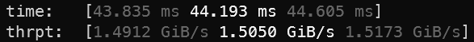
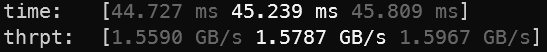

# `criterion-decimal-throughput` &ndash; KB/s, MB/s, GB/s in Criterion.rs outputs

[](https://github.com/V0ldek/criterion-decimal-throughput/actions/workflows/rust.yml)
[](https://docs.rs/criterion-decimal-throughput)

[](https://crates.io/crates/criterion-decimal-throughput)
[](https://github.com/V0ldek/criterion-decimal-throughput/releases)
[](https://github.com/V0ldek/criterion-decimal-throughput/commits/main)

[](https://choosealicense.com/licenses/mit/)

## DEPRECATION

**This crate is now obsolete as Criterion added this functionality in v0.4.0 as `Throughput::BytesDecimal`. Please migrate your Criterion version.**

<hr/>

Custom measurement format for Criterion.rs that displays throughput in decimal byte-multiples (KB/s, MB/s, GB/s) instead of binary (KiB/s, MiB/s, GiB/s).

## Features

Under default Criterion.rs measurements, the output of a benchmark with throughput configured will look like this:



meaning '1.5050 * 2^(30)' which is fine, I guess, but I'm not good enough at on-the-fly calculations to see at a glance that this is, in fact, a mean of around 1.6 billion bytes. With this crate we get:



which is a much nicer '1.5787e9'. It is quite subjective to prefer one over the other, but Criterion.rs forces you into binary. If you share my preference, this crate allows you to get nicer numbers.

## Usage

Simply use the provided `decimal_byte_measurement` function for default configuration,
or set the `DecimalByteMeasurement` type as measurement manually. See the example on [docs.rs](https://docs.rs/criterion-decimal-throughput/1.0.0/criterion_decimal_throughput/index.html).

## Installation

Add `criterion-decimal-throughput` as your dev-dependency, either with `cargo`:

```bash
cargo add --dev criterion-decimal-throughput
```

Alternatively, add it directly to the `dev-dependencies` section of your `Cargo.toml`:

```toml
[dev-dependencies]
criterion-decimal-throughput = "1.0.0"
```

## Build & test

Simply use `cargo`:

```bash
cargo build
cargo test
```

## Contributing

See [Contribution Guide](CONTRIBUTING.md).
